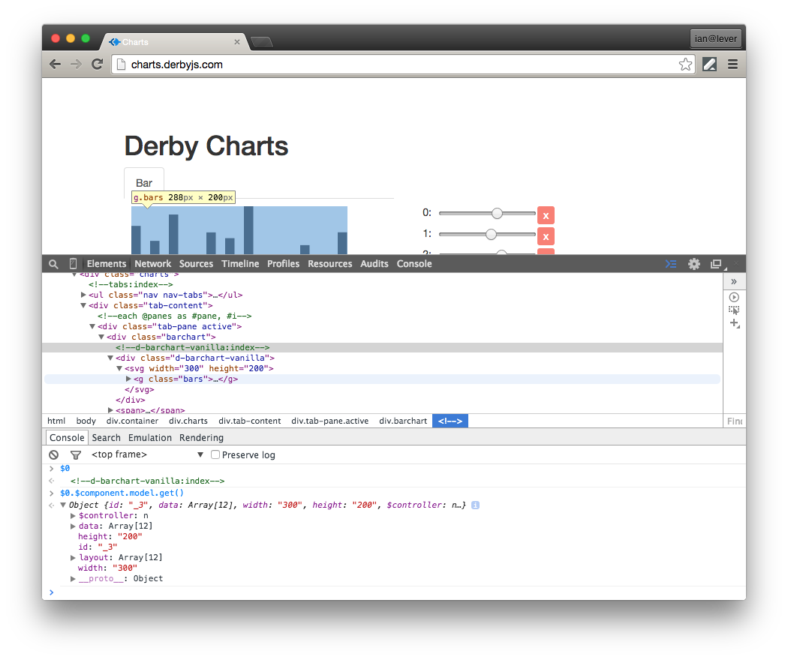

# View partials

This page goes into more detail about how view partials relate to components. For more general concepts, see the [template syntax](../views/template-syntax) documentation.

While a component's controller is associated with a single view, it can contain sub-views defined as view partials. Components can also accept other views passed in as attributes.

## Scope
By default a view partial inherits the scope where it is instantiated.

```jinja
<index:>
  {{foo}}
  {{with #root.bar as #bar}}
    <view is="my-partial"></view>
  {{/with}}

<my-partial:>
  i can render {{foo}} and {{#bar}}
```
A view partial associated with a component follows the [component scope](scope) rules. A view partial used inside a component will inherit the scope of the component.

### extend
It is possible to override another component's functionality while preserving its view. You can do this with the `extend` keyword.

<p class="codepen" data-height="200" data-theme-id="0" data-default-tab="result" data-user="nateps" data-slug-hash="OJJXRQb"></p>

<script async src="https://static.codepen.io/assets/embed/ei.js"></script>


### import
If you just want to reuse a view partial the `import` keyword is probably more appropriate. See the [namespaces and files](../views/namespaces-and-files#structuring-views-in-multiple-files) documentation for more details.


## Component tracking
Derby components are tracked in the DOM with an HTML comment tag. This allows components to be responsible for arbitrary DOM content, for example two table rows that otherwise cannot be wrapped by any other DOM elements.

```jinja
<!-- namespace:component:name -->
```

## Debugging

A relatively quick way to inspect a component for debugging is to find its comment in the browser's DOM inspector.
In modern browsers clicking on the comment allows you to reference it in the console with `$0`.
Once you have a reference to the comment tag, you can access it's controller with `$0.$component` and its model data with `$0.$component.model.get()`



### derby-debug
There is a plugin which makes accessing your components from the console even more accessible that is recommended for development.
Read more about [derby-debug](https://github.com/derbyjs/derby-debug).
